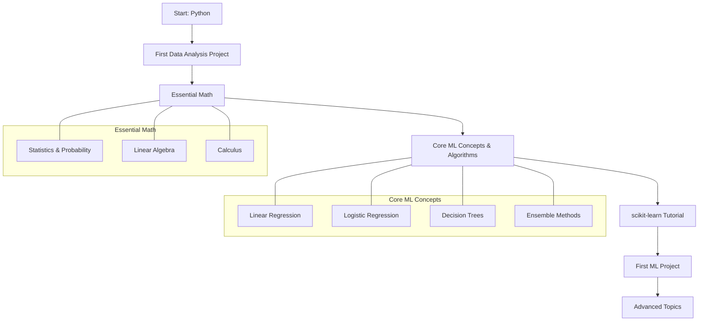

# Machine Learning - Not a Short Journey

## Introduction

So you want to learn machine learning and you somehow ended up here? Well, I've got good news and bad news.

The bad news: I'm not here to sell you some "become an ML engineer in 3 months" fantasy. Could it happen? Sure. People also win the lottery.

The good news: I've been exactly where you are. About 8 years ago, I thought I knew enough basics to just apply for jobs and learn the rest while working. Spoiler alert: I failed miserably. But those failures taught me exactly what works and what doesn't, and that's what I'm sharing today.

I've since taught all of this to hundreds of students in several countries, so I think I have a good idea of what works and what doesn't.. Hopefully, I can save you months of frustration by showing you the smart way to learn machine learning.

Learning data science was one of the best decisions I ever made, and most of you can do it. You will learn some cool stuff on the way that, even if you don't become a data scientist or machine learning engineer, you will have:
- Learned programming
- Learned how to build apps
- Learned how to analyze and visualize data
- Developed strong statistics and research skills
- Learned to communicate data clearly

Many amazing job options will be open to you even if you don't become a data scientist. But you will have to work hard.

But what should you work hard on? And how do we even start? That's what I'm here to tell you.

## Learning How to Learn

Before we even touch machine learning, let's talk about something crucial: **learning how to learn**. Why? Because machine learning and AI, like most things in tech, are constantly evolving. What matters isn't just what you know, but how quickly you can adapt and learn new things.

A little secret: I actually suck at programming and algorithms, but I am really good at learning new stuff.

Here's why this matters specifically for machine learning:

### 1. Technology Changes Fast
New platforms and frameworks drop constantly, and new papers come out daily. What's hot today might be obsolete tomorrow.

### 2. Problem Solving is Everything
Machine learning isn't about memorizing algorithms; it's about understanding data and patterns, breaking down complex problems, and finding creative solutions.

### 3. Confidence (AKA Don't Get Overwhelmed)
People who know how to learn and problem-solve don't get paralyzed when faced with a new big problem. They:
- Develop a strategy for how to look at a new problem
- Break it down into manageable problems they have faced before
- Know how to look up solutions and find tools necessary to solve new problems
- Adapt more quickly when tech changes

### 4. Efficiency
If you know how to learn, you won't waste time on unnecessary things. Time is money. Learn what you actually need to get where you want to be.

There's no one-size-fits-all solution for learning something. It depends on your style of learning but also on your goals. Not everyone needs to learn everything.

So how do you learn how to learn? This one you kind of have to figure out for yourself, because what works for one person doesn't necessarily work for the next:
- Some people learn well with graphs and diagrams
- Others with text
- Others maybe with voice notes
- Some people need to understand the theory before applying it
- Others need to jump right in and use an algorithm before asking what it actually does

In this guide, I will try to show you what worked for me while giving you resources that I believe will get you there as quickly as possible.

### The Pareto Principle (80/20 Rule)
I will just mention a principle that has helped me a lot throughout my career: the Pareto principle, sometimes called the 80/20 principle. It says that 80% of the results come from 20% of the effort.

Constantly ask yourself:
- Why am I doing this?
- Is this actually getting me where I want to be?
- Can I do something more useful with my time?

While the answer to this question isn't always the same for everyone, I will try to now give you the 20% of the work that would have gotten me 80% of the way to becoming a data scientist. Adapt as needed.

## The Roadmap: Building Your Machine Learning Foundation

### 1. Python

While the next skill is just as important, I would start by learning Python. The main reason is that you will get a feeling of achievement fairly quickly, and Python is super simple.

#### Why Python?
- Python is the main language of data analytics, data science, and machine learning
- It's also a full-fledged programming language allowing you to write scripts, build apps and websites, and much more
- Python will allow you to actually start writing real code within days without having to learn super complicated computer science concepts like pointers, memory allocation, and garbage collection
- With Python, you will be able to get a job as a programmer, data analyst, or web developer even if you don't learn all the hard machine learning stuff

#### What to Learn:
1. First, install Jupyter Notebooks as they make learning much easier, and Jupyter Notebooks are a core tool for data analysts and data scientists worldwide.
2. Then learn about these core concepts:
   - Programming fundamentals: basic syntax, indentation rules, comments, etc.
   - Variables
   - Math
   - If/else
   - Loops
   - Printing
   - Data types like strings, ints, floats, booleans
   - Lists
   - Dictionaries
   - Functions
   - Classes and objects
   - Modules, packages, and importing

3. Do a **pandas tutorial**. Pandas is Python's primary data manipulation library, built for handling tabular data through DataFrame objects. Imagine it as Excel spreadsheets on steroids. It will be your main tool for data analysis, cleaning, and transformation, with powerful functions for merging, reshaping, and analyzing data.

   The library's strength lies in combining the power of NumPy arrays with spreadsheet-like functionality and SQL database-like joins. It also comes with built-in plotting functionality built on top of Python's powerful Matplotlib libraries. Pandas is a true data analysis powerhouse.

   If you truly master pandas, you will excel at most data analysis positions in the world. Also, because exploratory data analysis and data preparation are about 60-80% of a data scientist's job, it will also lay the foundation for that 80/20 principle.

### 2. Your First Data Analysis Project

Before you get into any machine learning, I would take the time here to work on an actual project to deepen your Python, pandas, and data analysis knowledge. As I mentioned in my previous videos, real projects beat tutorials at developing a good data scientist.

- Find some data you want to analyze. Maybe from:
  - One of your old jobs or school
  - Your favorite health tracker
  - Ask friends if they have data they want analyzed
  - Download public data from the government, the World Bank, or a nonprofit

Any topic you're interested in is fine - it could be economics, sports, politics, video games, board games (this last one was a passion of one of my former students).

- Work on:
  - Importing the data into pandas
  - Cleaning up the data
  - Making the units uniform
  - Deciding what to do about missing data and outliers
  - Plotting the different variables
  - Looking at correlations between variables
  - Coming up with some hypotheses about the data and testing them by making more plots
  - Turn your results into a slideshow with nice graphs that tell a story that you can present to friends and family

**Pro tip**: Jupyter Notebooks with data and plots can be turned directly into a slideshow. This will also be the first project for your portfolio, which you can show when applying for jobs as a data analyst.

### 3. Essential Math for Machine Learning

This might be the part that most of you fear, but I think it is the most important for anyone wanting to learn machine learning. You should take this seriously.

You don't need to be a math genius or know about all of math to become good at machine learning, but you need to really understand the core concepts from the areas I'm about to mention. For more details on math for machine learning, check out my video on the topic.

#### Basic Statistics and Probability
This for me is the most important branch as a data analyst and data scientist.

There are many online resources for statistics, but I highly suggest taking the Khan Academy Statistics and Probability course. This course is completely free and is the one I took when I prepared for my first job as a data scientist.

The full course is about 50 hours of content. If you have prior math knowledge, you likely won't spend more than 100 hours on it, though it might take longer. But please take the time to do this. It will make everything that follows so much easier and save you much more than 100 hours of headaches later on.

Ideally, while you learn new concepts here, you go to your dataset from the previous data analysis project phase and try to apply them there to deepen your intuition.

#### Linear Algebra Fundamentals
While also important, linear algebra for machine learning is much more about learning some tools and rules. This should be much quicker than learning probability and statistics concepts.

The main thing you want to learn is how to operate with vectors and matrices and learn what the different operations mean. This is more about mathematical tools and notations than concepts.

I think learning this will take about a quarter to a third of the time it took you to learn the statistics concepts, so one or two weeks of studying should be enough for people with prior math knowledge.

I will also leave the link to the Khan Academy Linear Algebra course in the description.

#### Calculus
Here again, it's about learning some tools but also understanding what derivatives are conceptually and how they help in optimization problems. You should really understand how functions and their derivatives work and know the basic rules of differentiation, like the chain rule.

I would again calculate with one or two weeks if you have prior math knowledge. I will also leave a Khan Academy link in the description.

**Pro tip**: You need working knowledge, not a math PhD. Focus on intuition over proofs. Spend most your time on statistical concepts. For linear algebra and calculus, focus on learning the tools, like matrix operations and how to take the derivative of a function.

### 4. The Core Machine Learning Concepts and Algorithms

Now here's where many people mess up: they jump straight to deep learning. But that's a mistake. In my opinion, you should spend most of your time on simple algorithms.

The reasons for that are manifold and discussed in my previous videos, but basically:
- Many problems don't require complicated solutions
- Simple algorithms like linear regression are quicker to run
- They're more generalizable
- More interpretable and easier to learn from and communicate
- More importantly, these algorithms form the basis for the more complicated algorithms like neural networks, so truly understanding them will help you understand the more complicated algorithms better too

Check out my video on machine learning algorithms, but basically, before getting into neural networks or even SVM, make sure you understand how linear regression and logistic regression work. Then look at decision trees and ensemble algorithms like random forests and gradient boosting.

I learned most of these topics from the book "An Introduction to Statistical Learning". The majority of you will prefer learning from videos, so just watch the YouTube video series about this book by the authors themselves, completely for free on YouTube. I will leave a link in the description.

All the videos together are about 20 hours, but since you will want to pause and take notes and read up on certain concepts, I think this will be another 100 hours or so of study time. So that should be another two or more weeks of full-time self-study. All these numbers are estimates, as everyone learns at different speeds.

### 5. Do a scikit-learn Tutorial

scikit-learn is the number one machine learning library in the world for basic machine learning algorithms. You can do a basic sklearn tutorial in a day or two, and the good thing is that the simple and consistent syntax makes it such that once you know how to use the library for one algorithm, you know how to use it for any algorithm, as long as you know what algorithm is meant for what (which you now know because you just learned it!).

scikit-learn also comes with great documentation and toy datasets to play around with.

I suggest you start using scikit-learn while you are learning about the algorithms in the statistical learning course.

#### The Genius Move
While you learn about the theory behind new algorithms (for example, going through the statistical learning course and starting with linear regression), implement and use the algorithm in the following three ways:
1. Implemented from scratch using basic Python
2. Implemented using scikit-learn using a toy dataset
3. Then use both your own implementation and the scikit-learn toolkit to try out the algorithm on a real dataset that you have prepared yourself

Now, there's a common pitfall that many beginners get stuck in: "Tutorial Hell." It's where you essentially just keep following tutorials without striking out on your own and actually building something.

Most learning comes from the trial and error of building an application, so if you always follow a tutorial, you get stuck at a basic level.

How do you not get stuck there? Do just one or two tutorials per area maximum and then work on a real project.

### 6. Your First Machine Learning Project

Here you can either continue with your data analysis project from before, or find a new, more interesting dataset for a machine learning project.

But don't forget to still use pandas to do an exploratory data analysis, to prepare your data for modeling, and form hypotheses about your data.

More often than not, the goal of a machine learning project will be to predict some variable from other variables.

- Research the industry of your project a bit
- Look at the data and make some hypotheses about what might influence your target variable, either based on intuition about the industry or from looking at correlations and scatter plots of different variables
- Design new features based on your knowledge of the problem
- Then start modeling, but start with simple algorithms like linear regression, logistic regression, and decision trees
- Then move on to more complex algorithms like SVM, random forests, or gradient boosting

Note how as complexity increases, accuracy usually increases, but interpretability decreases. Your goal is usually to find a sweet spot.

Also, don't forget overfitting as you increase in model complexity. Keep validation and test sets aside before starting to model, and compare your models using the test set at the very end. Many times, the more complex algorithms don't look as good anymore once you use the final test set.

It might be a good idea to work with datasets that have been published on sites like Kaggle, to then compare your solutions and accuracies to other people's solutions and get an idea of how well your models are in comparison to others.

But don't get frustrated. A lot of people on Kaggle are professionals with years of experience. If you get anywhere close in accuracy, you should be happy.

#### Don't Know What to Work On?
You can start with a tutorial, but instead of following it directly, after building the core features:
- Add some features
- Change some features
- Swap out the dataset
- Try to break your code and then fix it

This is one of the best ways to learn while not getting stuck in tutorial hell.

### 7. Collaborate and Share Your Projects

Learning ML in isolation is the slowest way to learn. Instead:
- Find coding buddies to work on a project with
- Present your work to friends and family or post it publicly on GitHub or in machine learning communities
- Have someone more advanced than you give you feedback

This will speed up your learning 10 times.

Don't know anyone to work on a project with? Participate in a hackathon or write to people with similar interests on Kaggle, GitHub, Discord, Reddit, LinkedIn, etc.

The connections you form this way will not only help you learn better but boost your career in unexpected ways. Check out my most recent video to learn more about the importance of networking and data science.

### 8. Advanced Topics (Only After Mastering the Basics)

Only now should you look at more advanced topics:
- Deep learning architectures
- CNNs for computer vision
- RNNs for sequential data
- Transformers for NLP
- Advanced optimization techniques
- Model deployment strategies
- The latest research papers

Remember: Learn these by need, not by FOMO. You don't need to know everything. Just learn these techniques if they are important to your project.

## The Does and Don't

### Don't:
- Get stuck in tutorial hell
- Try to memorize everything
- Learn in isolation
- Chase every new trend
- Copy-paste code without understanding
- Try to learn every new fancy tool or research paper

### Instead:
- Build real projects
- Focus on understanding
- Share your progress
- Join communities
- Master fundamentals first
- Implement from scratch
- Learn by doing

## Timeline Estimate

| Phase | Estimated Time for Prior Knowledge | Estimated Time for Beginners |
|-------|-----------------------------------|------------------------------|
| Python Basics | 1-2 weeks | 2-4 weeks |
| First Data Analysis Project | 1-2 weeks | 2-3 weeks |
| Statistics & Probability | 2-3 weeks | 4-6 weeks |
| Linear Algebra | 1 week | 2 weeks |
| Calculus | 1 week | 2 weeks |
| Core ML Concepts | 2+ weeks | 4+ weeks |
| scikit-learn | 1-2 days | 3-5 days |
| First ML Project | 1-2 weeks | 2-4 weeks |
| **Total** | **~10 weeks** | **~20 weeks** |

This timeline assumes full-time study (~40 hours/week). For part-time study, multiply accordingly.

